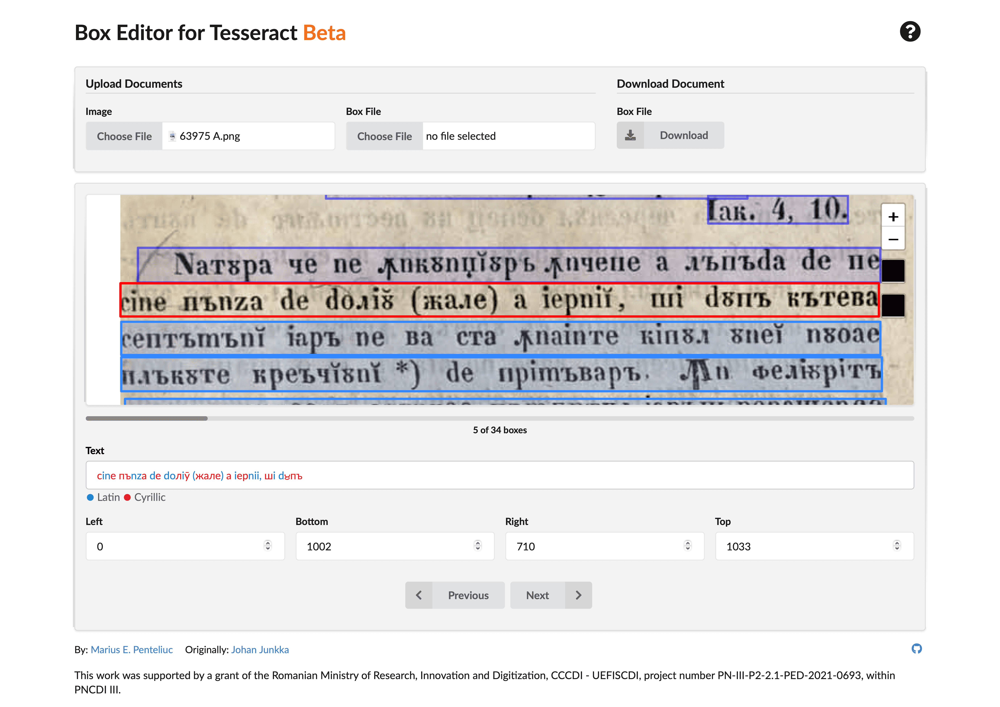

Web-based Box Editor for Tesseract OCR
-------------

Use app » [Box Editor for Tesseract OCR](https://www.penteliuc.com/box-editor-for-tesseract/)

Web app for editing Tesseract OCR LSTM box files in WordStr format, using [Tesseract OCR js](https://tesseract.projectnaptha.com), [leaflet mapping library](http://leafletjs.com), and [leaflet.draw](https://github.com/Leaflet/Leaflet.draw).

### Features
* Automatically detects text lines;
* Tools for adding, editing, and deleting bounding boxes;
* Upload existing box files;
* Download tagged text;
* Highlights Latin and Cyrillic characters;
* Be notified of potential issues and errors;
* Indicates document tagging progress;

### How to use
1. Upload an image and wait for bounding boxes to be automatically generated.
  - optionally, upload an existing box file to edit.
2. Correct generated bounding boxes.
  - add new boxes using the draw tool;
  - remove boxes using the delete tool;
  - edit boxes by clicking on them and dragging the handles, or adjusting the `Left`, `Bottom`, `Right`, and `Top` input fields.
3. Type the ground-truth into the text field.
4. Press `Return` or the `Next` button to commit current text line.
5. Download the edited box file using the `Download` button.

Keyboard shortcuts are available to navigate forward `control + shift + down` and backward `control + shift + up`.
NOTE: Keyboard shortcuts implementation is buggy and needs fixing.

### Features to add
- [ ] Keep session data using cookies;
- [ ] Upload ground-truth to fill boxes;
- [ ] Download ground-truth from box file;
- [ ] Add options to text highlighter;
- [ ] Fully support char-by-char tagging[^1];
- [ ] Add Dark Mode support;

### Acknowledgment
This work was supported by a grant of the Ministry of Research, Innovation and Digitization, CCCDI - UEFISCDI, project number PN-III-P2-2.1-PED-2021-0693, within PNCDI III.

Project website: [https://transitional-romanian-transliteration.azurewebsites.net](https://transitional-romanian-transliteration.azurewebsites.net)

----------
Original Source Code by [Johan Junkka](http://johanjunkka.com/)

[^1]: legacy character-by-character box editing is suppported, although it is not actively maintained.
