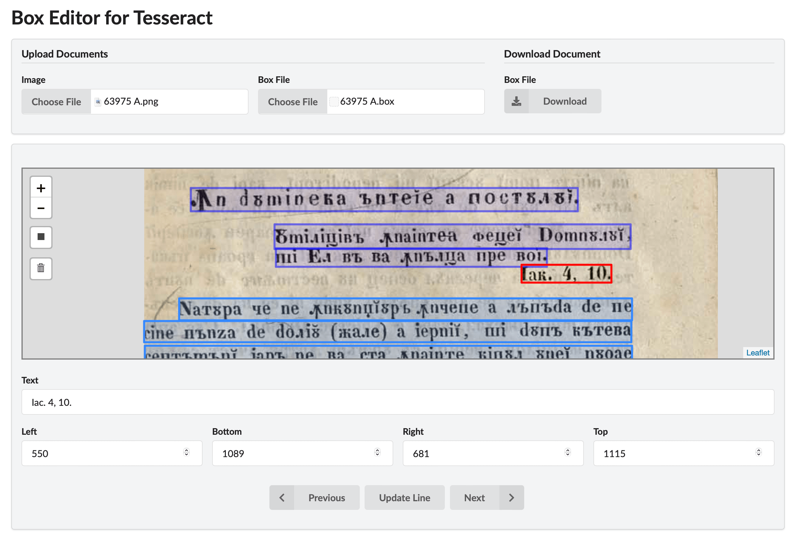

Web-based Box Editor for Tesseract OCR
-------------

Use app » [Box Editor for Tesseract OCR](http://penteliuc.com/utilities/box-editor/)

Web app for editing Tesseract OCR box files, using the [leaflet mapping library](http://leafletjs.com) and [leaflet.draw](https://github.com/Leaflet/Leaflet.draw).
Supports simple character-by-character box editing and WordStr format.
The box file format is detected automatically at upload.

### How to use
Upload an image and its corresponding box file.
Edit each box's info by typing the characters visible inside the box into the `Text` field.
Adjust a box's bounds using the `Left`, `Bottom`, `Right`, and `Top` fields.
Add new boxes by drawing them with the `Rectangle` tool.
Delete the selected box by clicking on the `Trash` icon.

Press the `Return` key after editing to commit and move to the next box.
Use the `Previous` and `Next` buttons to navigate boxes.
Keyboard shortcuts are available to navigate forward `control + shift + down` and backward `control + shift + up`.

Currently, the app does not work properly if no box file is uploaded.

### Features to add
- [ ] Visual confirmation of successful line update;
- [ ] Generate box file from scratch;
- [ ] Keep session data using cookies;
- [ ] Notify users of background actions.

### Acknowledgment
This work was supported by a grant of the Ministry of Research, Innovation and Digitization, CCCDI - UEFISCDI, project number PN-III-P2-2.1-PED-2021-0693, within PNCDI III.

Project website: [https://transitional-romanian-transliteration.azurewebsites.net](https://transitional-romanian-transliteration.azurewebsites.net) (pending...)

----------
Original Source by [Johan Junkka](http://johanjunkka.com/)
